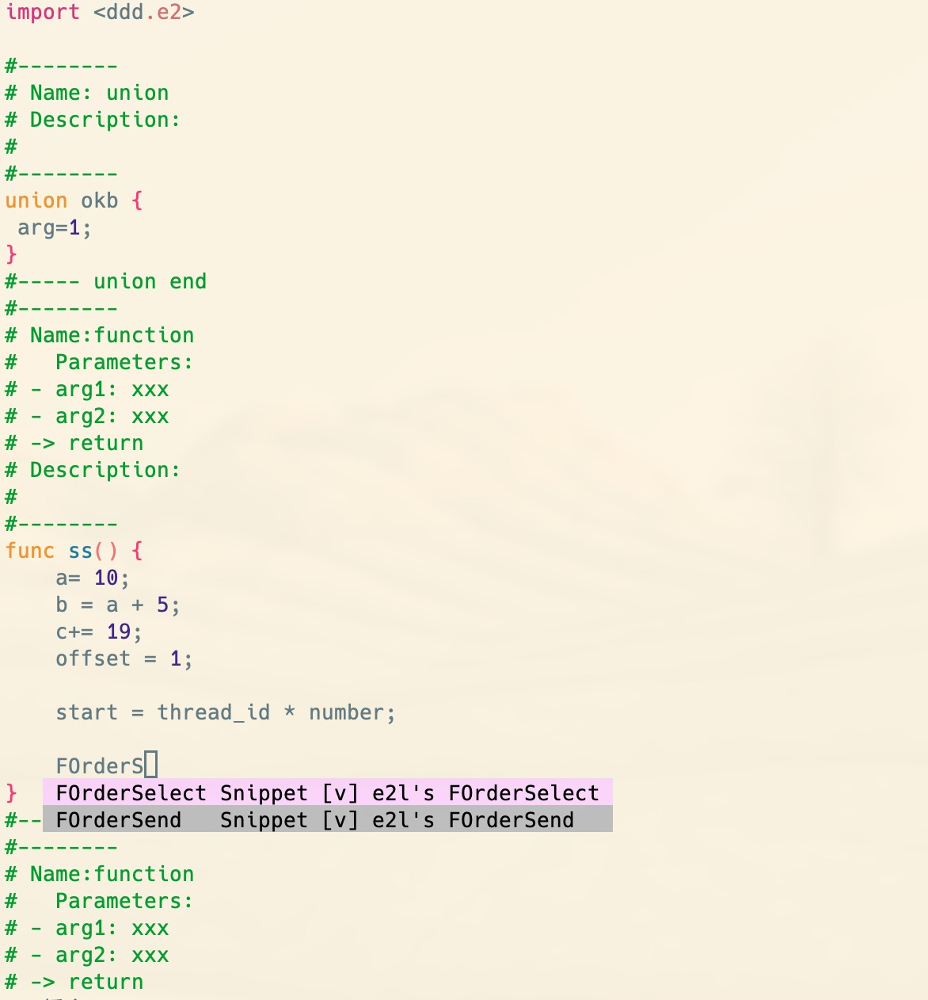

# vim for e2language IDE

## 下载 

```
git clone https://github.com/E2Quant/vim_for_e2l_ide.git
```

## run this shell

```shell
~/
mkdir .vim
cp vim_for_e2l_ide/.vimrc ./
cp vim_for_e2l_ide/e2_asyncomplete.vim .vim/
cp vim_for_e2l_ide/e2l.vim .vim/
cp vim_for_e2l_ide/e2l.ctags .vim/
cp -R vim_for_e2l_ide/vsniptxt/ .vim/
git clone https://github.com/VundleVim/Vundle.vim.git ~/.vim/bundle/Vundle.vim
vim .vimrc

## in vim run this, plugin install help visit this  https://github.com/VundleVim/Vundle.vim.git

:PluginInstall
```

如下图:

